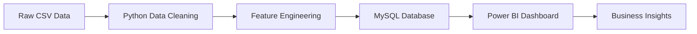

# Luxury Housing Sales Analysis - Bengaluru 🏘️

[](https://python.org)
[](https://mysql.com)
[](https://powerbi.microsoft.com)
[]()

## 📋 Project Overview

A comprehensive **end-to-end real estate analytics solution** that replicates enterprise-level data pipeline workflows. This project processes 100,000+ luxury housing records from Bengaluru market using Python for advanced data cleaning, SQL for data warehousing, and Power BI for interactive business intelligence dashboards.

### 🎯 Business Objectives

- **Market Intelligence**: Identify high-performing localities, builder trends, and configuration demand patterns
- **Sales Optimization**: Analyze booking conversion rates and identify customer drop-off points  
- **Buyer Persona Analysis**: Segment customers using buyer types and sentiment analysis
- **Competitive Pricing**: Compare pricing strategies across developers and market segments
- **Investment Insights**: Track quarterly real estate patterns for strategic decision-making

## 🛠️ Technical Stack

| Component | Technology | Purpose |
|-----------|------------|---------|
| **Data Processing** | Python (Pandas, NumPy) | Data cleaning, transformation, feature engineering |
| **Database** | MySQL | Data warehousing, storage, and querying |
| **Visualization** | Power BI | Interactive dashboards and business intelligence |
| **Development** | Jupyter Notebook | Exploratory data analysis and prototyping |

## 📊 Dataset Information

- **Size**: 100,000+ records
- **Domain**: Luxury Real Estate - Bengaluru Market
- **Time Period**: Q3 2023 - Q1 2025
- **Key Attributes**: Property details, pricing, buyer demographics, location metrics

### 📋 Core Data Fields
```
- Property_ID, Micro_Market, Project_Name, Developer_Name
- Unit_Size_Sqft, Configuration, Ticket_Price_Cr
- Transaction_Type, Buyer_Type, Purchase_Quarter
- Connectivity_Score, Amenity_Score, Locality_Infra_Score
- Possession_Status, Sales_Channel, NRI_Buyer
- Avg_Traffic_Time_Min, Buyer_Comments
```

## 🏗️ Architecture & Workflow



### Phase 1: Python Data Processing ✅ **COMPLETED**
- **Data Cleaning**: Handle inconsistent formats, missing values, and data quality issues
- **Feature Engineering**: Create derived metrics like Price_per_Sqft, Quarter_Number, Booking_Flag
- **Data Standardization**: Normalize text fields, standardize categorical values
- **Validation**: Ensure data integrity and consistency

### Phase 2: SQL Data Warehousing ✅ **COMPLETED**  
- **Schema Design**: Optimized table structure for analytical queries
- **Data Loading**: Efficient bulk insert operations using SQLAlchemy
- **Data Validation**: Comprehensive validation queries and sanity checks
- **Performance Optimization**: Indexed columns for faster query execution

### Phase 3: Power BI Analytics Dashboard 🚧 **IN PROGRESS**
- **Live SQL Connection**: Direct connection to MySQL database
- **Interactive Dashboards**: Multi-faceted analytical views
- **KPI Tracking**: Key performance indicators and metrics
- **Advanced Analytics**: DAX calculations and business intelligence features

## 💻 Installation & Setup

### Prerequisites
```bash
Python 3.8+
MySQL Server 8.0+
Power BI Desktop
Git
```

## 📈 Key Analytical Insights

### Market Performance Metrics
- **Booking Conversion Rates** by micro-market and developer
- **Price Trends** across different property configurations
- **Buyer Behavior Patterns** segmented by demographics
- **Seasonal Demand Fluctuations** quarterly analysis

### Business Intelligence Queries
```sql
-- Top performing developers by average ticket size
SELECT Developer_Name, AVG(Ticket_Price_Cr) as avg_price, COUNT(*) as projects
FROM real_estate_projects 
GROUP BY Developer_Name 
ORDER BY avg_price DESC;

-- Booking conversion rates by micro-market
SELECT Micro_Market, 
       SUM(Booking_Flag) as bookings,
       COUNT(*) as total_inquiries,
       (SUM(Booking_Flag) * 100.0 / COUNT(*)) as conversion_rate
FROM real_estate_projects 
GROUP BY Micro_Market;
```

## 🎯 Power BI Dashboard Features (In Development)

### Planned Visualizations
1. **Market Trends Dashboard**
   - Quarterly booking trends across micro-markets
   - Interactive time-series analysis

2. **Builder Performance Analytics**  
   - Revenue comparison and market share analysis
   - Average ticket size benchmarking

3. **Location Intelligence**
   - Geographic heat maps of property concentration
   - Connectivity and amenity score correlations

4. **Customer Segmentation**
   - Buyer type distribution and preferences
   - NRI vs domestic buyer analysis

5. **Pricing Strategy Insights**
   - Configuration-wise pricing trends  
   - Price per sq.ft analysis by location

## 📁 Project Structure
```
luxury-housing-analysis/
├── data/
│   └── Luxury_Housing_Bangalore.csv
├── notebooks/
│   └── bangalore_house.ipynb
├── sql/
│   └── bangalore_house.sql
├── dashboards/
│   └── power_bi_dashboard.pbix (Coming Soon)
├── docs/
│   └── Luxury-Housing-Sales-Analysis.pdf
└── README.md
```

## 🎯 Current Status & Next Steps

### ✅ Completed Components
- [x] **Data Cleaning & Preprocessing**: Python-based ETL pipeline
- [x] **Database Design**: MySQL schema and data loading
- [x] **SQL Analytics**: Validation queries and basic aggregations
- [x] **Documentation**: Comprehensive project documentation

### 🚧 In Progress  
- [ ] **Power BI Dashboard Development**: Interactive visualization layer
- [ ] **Advanced DAX Calculations**: KPI metrics and business intelligence
- [ ] **Dashboard Optimization**: Performance tuning and user experience

### 🔮 Planned Enhancements
- [ ] **Automated Data Pipeline**: Scheduled data refreshes
- [ ] **Machine Learning Models**: Price prediction and demand forecasting  
- [ ] **Advanced Analytics**: Cohort analysis and customer lifetime value
- [ ] **Web Application**: Streamlit-based interactive interface

## 📊 Sample Data Preview

| Property_ID | Micro_Market | Developer_Name | Configuration | Ticket_Price_Cr | Booking_Flag |
|-------------|--------------|----------------|---------------|-----------------|--------------|
| PROP000001 | Sarjapur Road | RMZ | 4BHK | 12.75 | 1 |
| PROP000002 | Indiranagar | Puravankara | 3BHK | 16.29 | 1 |
| PROP000003 | Bannerghatta Road | Tata Housing | 4BHK | 10.52 | 1 |

## 🤝 Contributing

1. Fork the repository
2. Create a feature branch (`git checkout -b feature/AmazingFeature`)
3. Commit your changes (`git commit -m 'Add some AmazingFeature'`)
4. Push to the branch (`git push origin feature/AmazingFeature`)
5. Open a Pull Request

## 📧 Contact

**Project Developer**: [Deepak Manian]
- LinkedIn: [www.linkedin.com/in/deepak-manian]

## 📄 License

This project is licensed under the MIT License - see the [LICENSE](LICENSE) file for details.

## 🙏 Acknowledgments

- **Dataset Source**: Real Estate Market Research Data
- **Technical Guidance**: Data Analytics Best Practices
- **Business Context**: Bengaluru Luxury Housing Market Insights

---

**⭐ Star this repository if you find it helpful!**

*Last Updated: September 2025*
